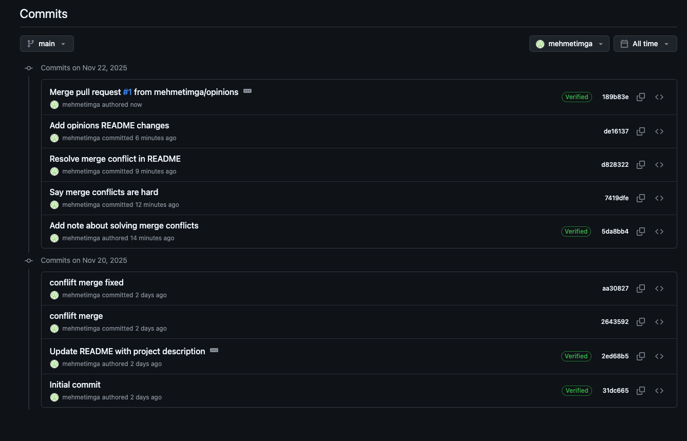
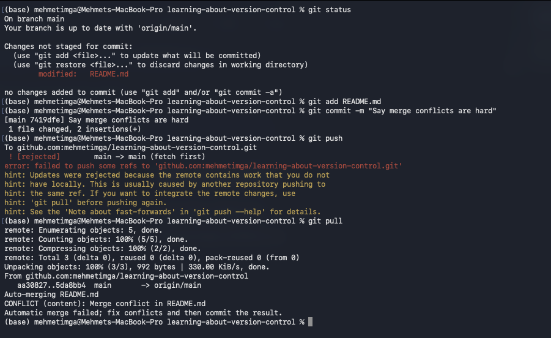
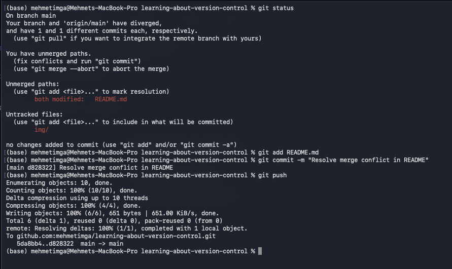
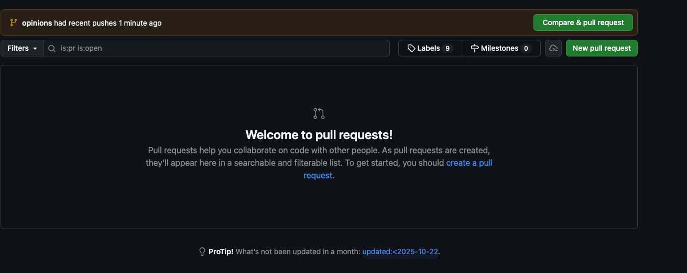
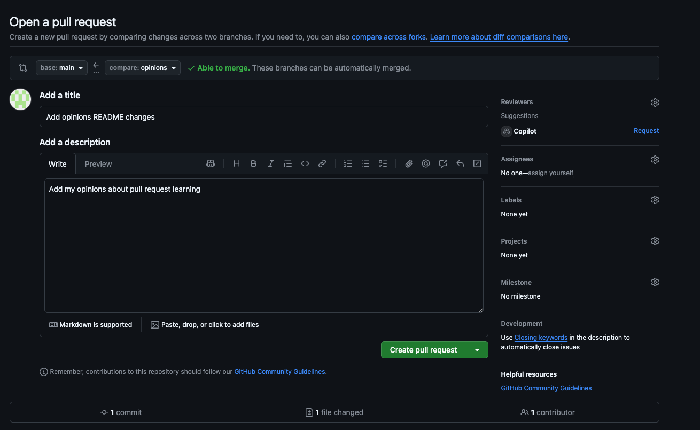
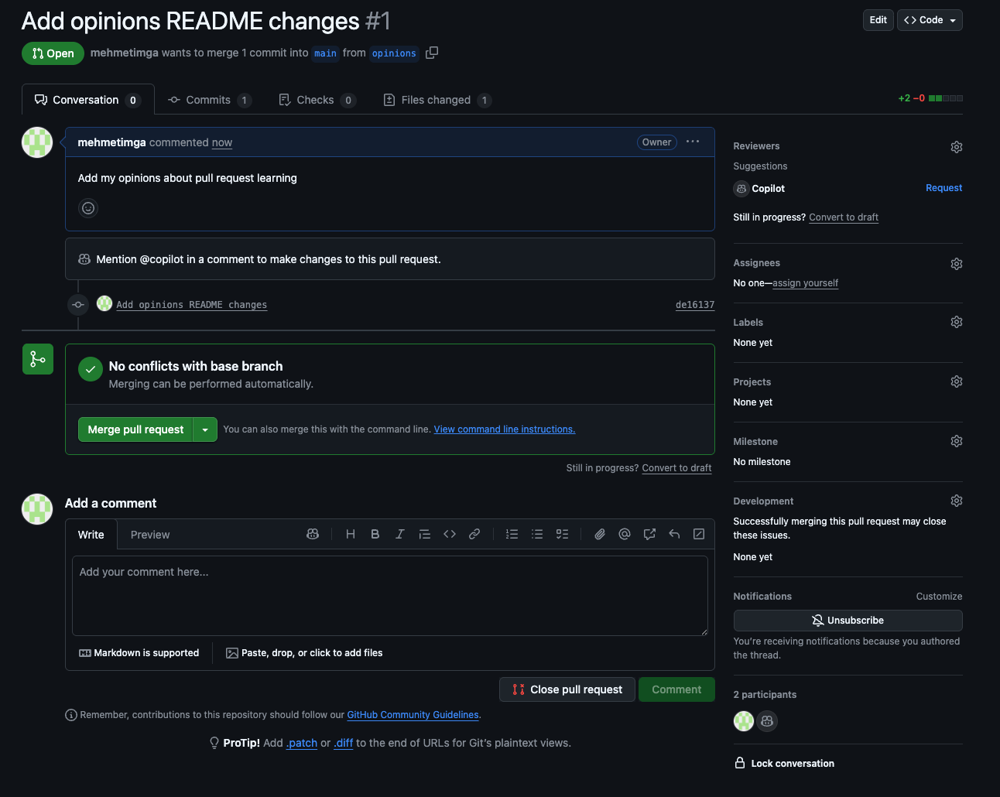
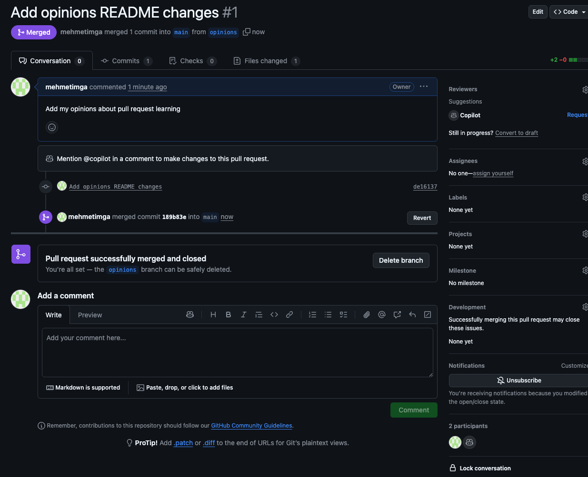

- **Student**: Mehmet Imga  
- **Repository**: `learning-about-version-control`  
- **Commit history URL**: `https://github.com/mehmetimga/learning-about-version-control/commits/main`

---

## Evidence of Steps

### 1. Commit history on GitHub

---

### 2. Creating and resolving a merge conflict

#### a. Merge conflict shown in editor

*(This is the required screenshot of the merge conflict while resolving it.)*

---

### 3. Working with branches and merging

#### a. Creating and working on the `opinions` branch

#### b. Creating a pull request on GitHub

#### c. Reviewing and merging the pull request

---

## Explanation: Why use a branch + pull request workflow?

Working in a branch–pull request workflow is useful because it keeps the `main` branch more stable: you can experiment and make changes in a separate branch without immediately affecting the production-ready code. Pull requests also create a clear place for code review and discussion, so teammates (or your future self) can check, comment on, and approve changes before they are merged. This workflow supports collaboration and helps catch mistakes early, which reduces the risk of breaking the main branch.

